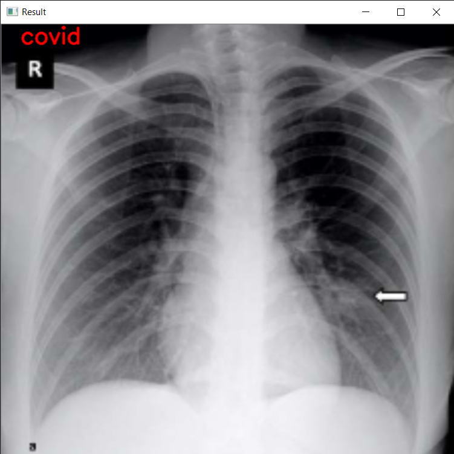
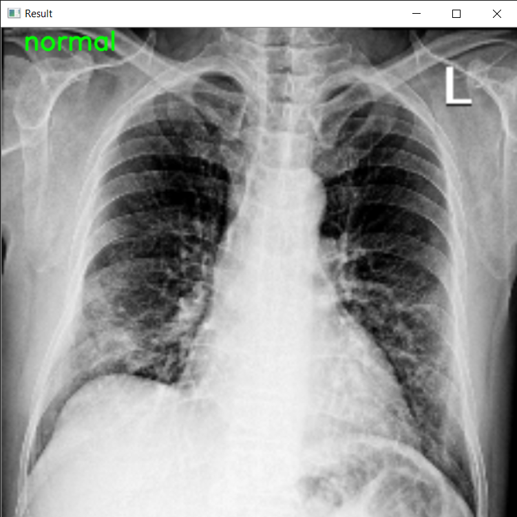

# COVID-19-Detection-through-Chest-X-Ray

<h1>Background:</h1>

The outbreak of Severe Acute Respiratory Syndrome Coronavirus 2 (SARS-COV-2) has caused more than 17.5 million cases of Corona Virus Disease (COVID-19) in the world so far, with that number continuing to grow. To control the spread of the disease, screening large numbers of suspected cases for appropriate quarantine and treatment is a priority.

The standard COVID-19 tests are called PCR (Polymerase chain reaction) tests which look for the existence of antibodies of a given infection. But there are a few issues with the test. Pathogenic laboratory testing is the diagnostic gold standard but it is time-consuming with significant false-negative results.

Moreover, large scale implementation of the COVID-19 tests which are extremely expensive cannot be afforded by many of the developing & underdeveloped countries hence if we can have some parallel diagnosis/testing procedures using Artificial Intelligence & Machine Learning and leveraging the historical data, it will be extremely helpful. This can also help in the process to select the ones to be tested primarily. Fast and accurate diagnostic methods are urgently needed to combat the disease.

<h1>Datasets Used:</h1>
<ol>
    <li>COVID-19 X-ray Images : https://github.com/ieee8023/covid-chestxray-dataset</li>
    <li>Pneumonia and Healthy Patients X-ray Images : https://www.kaggle.com/paultimothymooney/chest-xray-pneumonia</li>
</ol>

<h1>Techniques and Methodology:</h1>

<h2>Proposed Model/Algorithm:</h2>

For the purpose of this project, I propose to implement a model based on Convolutional Neural Network (CNN). A Convolutional Neural Network (ConvNet/CNN) is a Deep Learning algorithm which can take in an input image, assign importance (learnable weights and biases) to various aspects/objects in the image and be able to differentiate one from the other. The pre-processing required in a ConvNet is much lower as compared to other classification algorithms. While in primitive methods filters are hand-engineered, with enough training, ConvNets have the ability to learn these filters/characteristics.

The architecture of a ConvNet is analogous to that of the connectivity pattern of Neurons in the Human Brain and was inspired by the organization of the Visual Cortex. Individual neurons respond to stimuli only in a restricted region of the visual field known as the Receptive Field. A collection of such fields overlaps to cover the entire visual area.

<h2>Working of Model:</h2>

<b>Step 1:</b> Initialising the CNN model.

<b>Step 2:</b> Add Convolutional layer. The objective of the Convolution Operation is to extract the high-level features such as edges, from the input image. ConvNets need not be limited to only one Convolutional Layer. Conventionally, the first ConvLayer is responsible for capturing the Low-Level features such as edges, colour, gradient orientation, etc. With added layers, the architecture adapts to the High-Level features as well, giving us a network, which has the wholesome understanding of images in the dataset, similar to how we would.

<b>Step 3:</b> Add Pooling Layer. The Pooling layer is responsible for reducing the spatial size of the Convolved Feature. This is to decrease the computational power required to process the data through dimensionality reduction. Furthermore, it is useful for extracting dominant features which are rotational and positional invariant, thus maintaining the process of effectively training the model. There are two types of Pooling: Max Pooling and Average Pooling.

<b>Step 4:</b> Add Convolutional layer and Pooling layer again to increase the accuracy.

<b>Step 5:</b> Flatten. Flatten layer is used to flatten images in to column vector. The flattened output is fed to a feed-forward neural network and backpropagation applied to every iteration of training

<b>Step 6:</b> Fully Connected Layer (Adding ANN layer into this model).

<b>Step 7:</b> Compile the model.

<b>Step 8:</b> Train the Model.

<b>Step 9:</b> Save the Model.

<h1>Usage:</h1>

<h2>Model File:</h2>

Download the model (corona.h5) form <a href="https://drive.google.com/drive/folders/1EWWdI_Sb9OZVoi3magXk4R20GYsf2I8W?usp=sharing">here</a> and keep it in same folder where corona.py present.

<h2>Running Script:</h2>

Use Command: 

    python corona.py --image <image path>

<h1>Examples:</h2>

    python corona.py --image test_set/patient1.png
    

    python corona.py --image test_set/patient2.jpg
    

<h1>Django Project for Detecting COVID-19 and Pneumonia through Human chest X-Ray Images:</h1>

<h2>ScreenShots:</h2>

<h2>Description Video:</h2>

